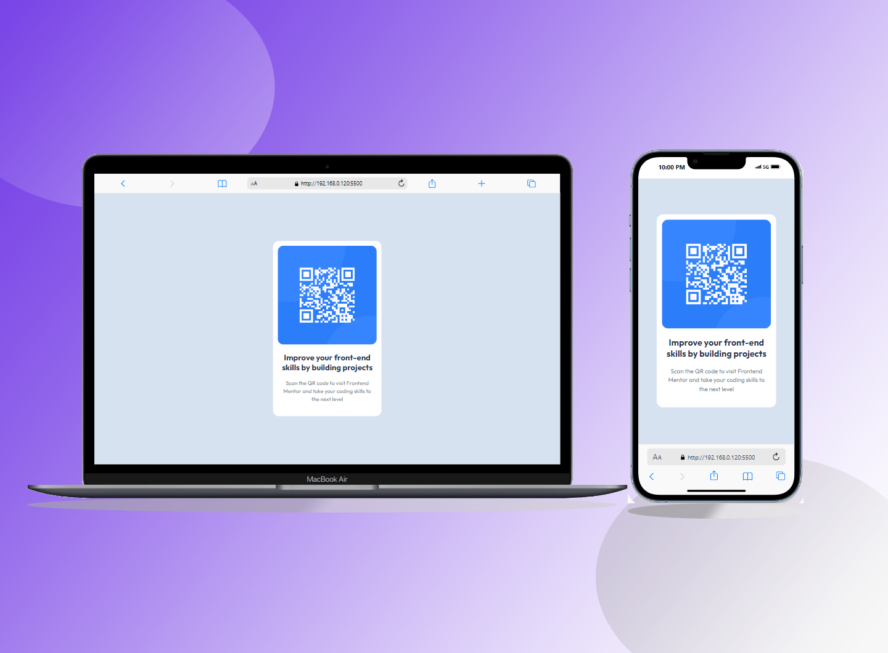

# Frontend Mentor - QR code component solution

This is a solution to the [QR code component challenge on Frontend Mentor](https://www.frontendmentor.io/challenges/qr-code-component-iux_sIO_H). Frontend Mentor challenges help you improve your coding skills by building realistic projects.

## Table of contents

- [Overview](#overview)
  - [Screenshot](#screenshot)
  - [Links](#links)
- [My process](#my-process)
  - [Built with](#built-with)
  - [What I learned](#what-i-learned)
- [Author](#author)

**Note: Delete this note and update the table of contents based on what sections you keep.**

## Overview

### Screenshot



### Links

- Solution URL: [Add solution URL here](https://your-solution-url.com)
- Live Site URL: [Add live site URL here](https://emmanuel-dev3.github.io/qr-code-component-main/)

## My process

### Built with

- Semantic HTML5 markup
- CSS custom properties
- Flexbox
- CSS Grid

### What I learned

I learned how to center a div vertically and horizontally using CSS flexbox.

```html
<section class="parent">
  <div class="children">
    
    <div class="content">
      <h2>Improve your front-end skills by building projects</h2>
      <p>
        Scan the QR code to visit Frontend Mentor and take your coding skills to
        the next level
      </p>
    </div>
  </div>
</section>
```

```css
.parent {
  height: 100vh;
  display: flex;
  justify-content: center;
  align-items: center;
}

.children {
  width: 17rem;
  padding: 0.8rem;
  border-radius: 1rem;
}

.content {
  text-align: center;
  padding: 0.4rem 0.3rem;
}
```

## Author

- Website - [Emmanuel chukwu](https://emmanuel-dev3.github.io/qr-code-component-main/)
- Frontend Mentor - [@emmanuel-dev3](https://www.frontendmentor.io/profile/emmanuel-dev3)
